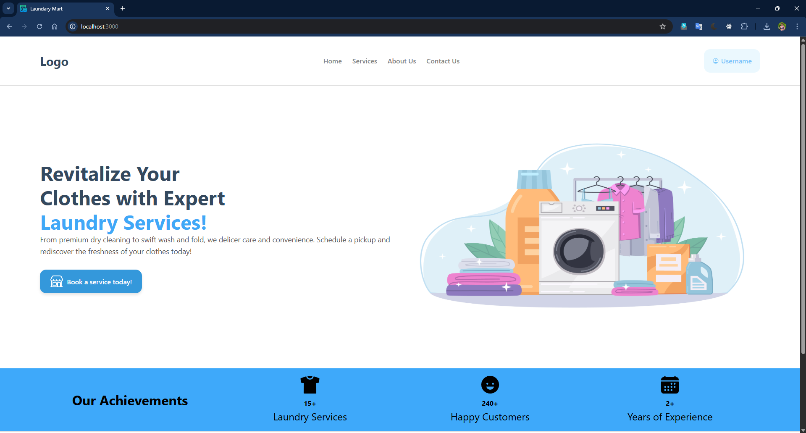
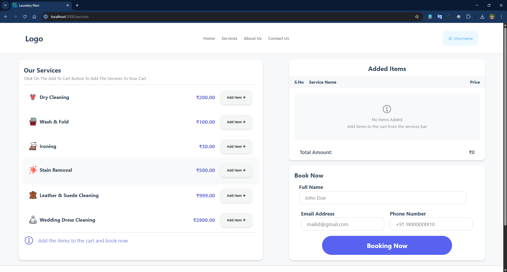
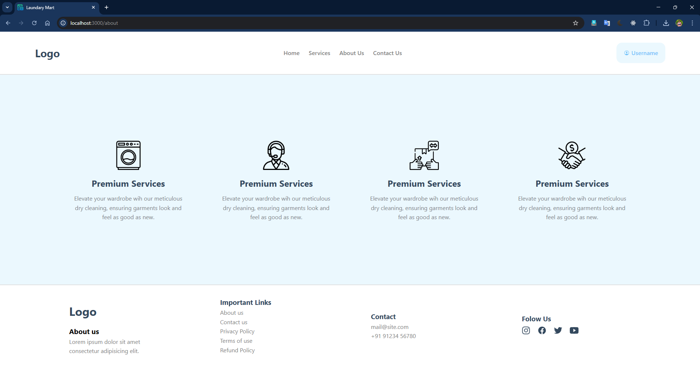
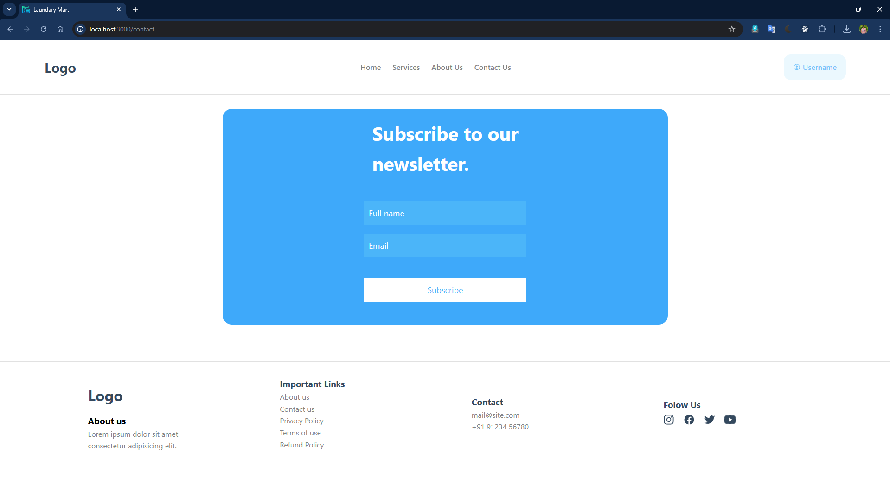
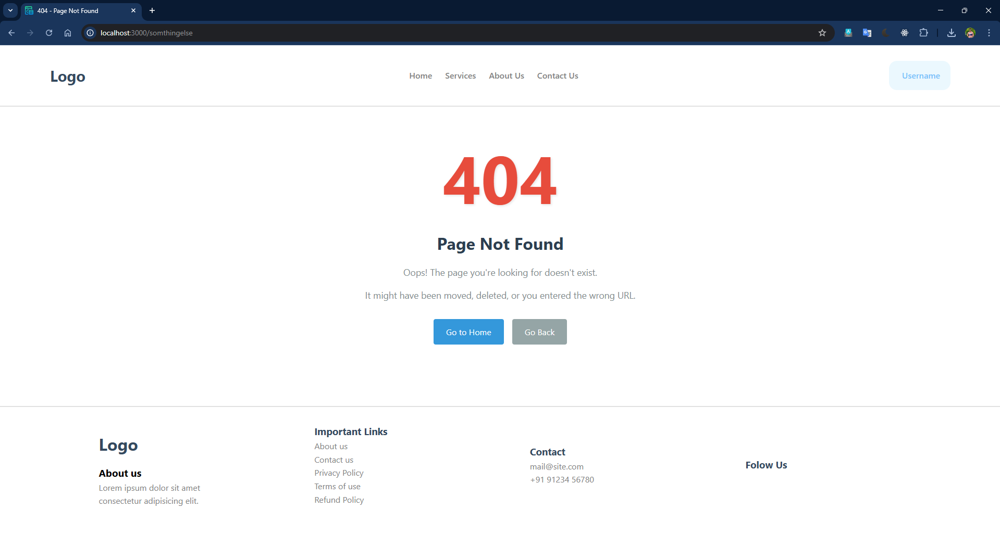
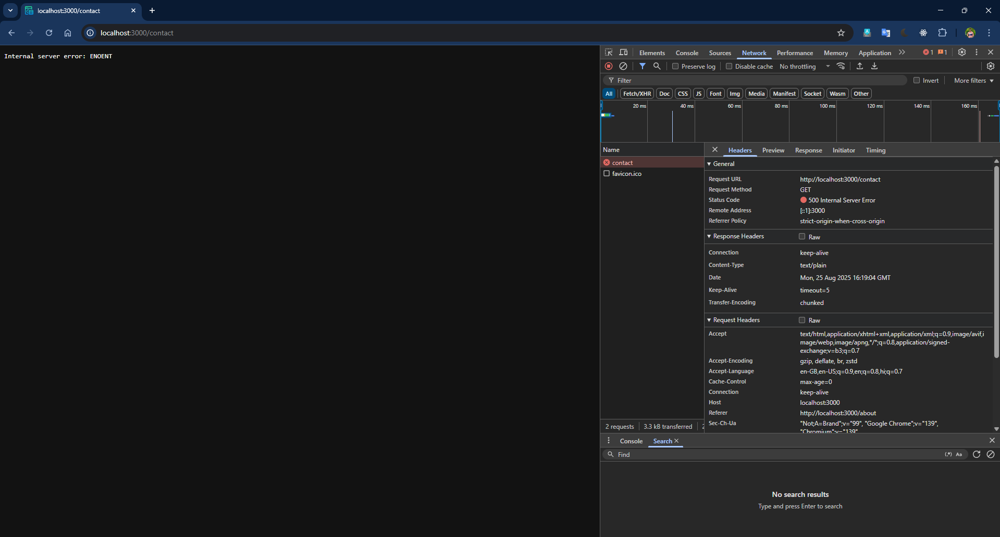

# 🧺 Laundry Mart - Node.js Web Server

A professional laundry service website built with vanilla Node.js, featuring a complete booking system, responsive design, and efficient static file serving.

## 🛣️ API Routes

| Route | Method | File Served | Description |
|-------|--------|-------------|-------------|
| `/` | GET | `views/index.html` | Home page |
| `/home` | GET | `views/index.html` | Home page (alternative) |
| `/services` | GET | `views/services.html` | Services & booking page |
| `/about` | GET | `views/about.html` | About us page |
| `/contact` | GET | `views/contact.html` | Contact & newsletter |
| `/*` | GET | `views/404.html` | 404 error page |

## 📸 Screenshots

### 🏠 Home Page ( / or /home )

### 🛍️ Services Page ( /services )

### ℹ️ About Page ( /about )

### 📞 Contact Page ( /contact )

### ❌ 404 Error Page
*If page not fount*

### ❌ Internal server error
*If unexpected Error*

